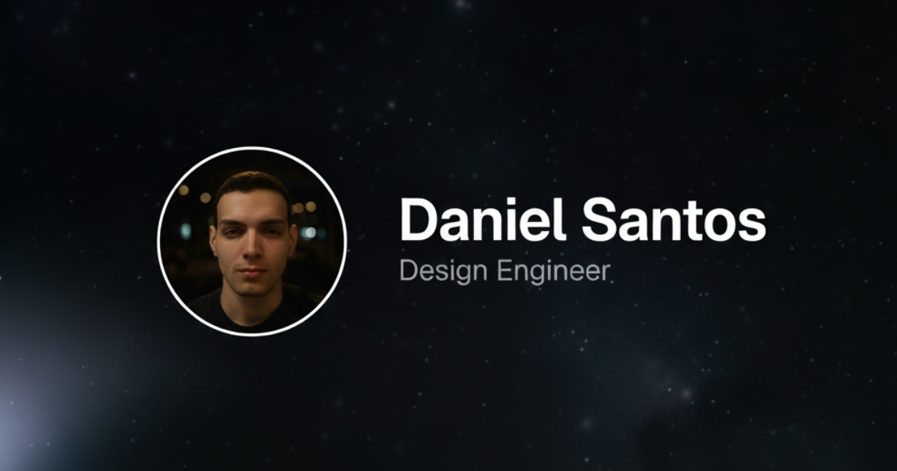

# Magic Portfolio

Magic Portfolio is a simple, clean, beginner-friendly portfolio template. It supports an MDX-based content system for projects and blog posts, an about / CV page and a gallery.

View the live demo: [Magic Portfolio Demo](https://demo.magic-portfolio.com).



## Getting started

### 1. Clone the repository

```bash
git clone https://github.com/once-ui-system/magic-portfolio.git
```

### 2. Install dependencies

```bash
npm install
```

### 3. Run dev server

```bash
npm run dev
```

### 4. Edit config

```text
src/resources/once-ui.config.js
```

### 5. Edit content

```text
src/resources/content.js
```

### 6. Create blog posts / projects

```text
Add a new .mdx file to src/app/blog/posts or src/app/work/projects
```

Magic Portfolio was built with [Once UI](https://once-ui.com) for [Next.js](https://nextjs.org). It requires Node.js v18.17+.

## Documentation

Docs available at: [docs.once-ui.com](https://docs.once-ui.com/docs/magic-portfolio/quick-start)

## Features

### Once UI

- All tokens, components & features of [Once UI](https://once-ui.com)

### SEO

- Automatic open-graph and X image generation with next/og
- Automatic schema and metadata generation based on the content file

### Design

- Responsive layout optimized for all screen sizes
- Timeless design without heavy animations and motion
- Endless customization options through [data attributes](https://once-ui.com/docs/theming)

### Content

- Render sections conditionally based on the content file
- Enable or disable pages for blog, work, gallery and about / CV
- Generate and display social links automatically
- Set up password protection for URLs

### Localization

- A localized, earlier version of Magic Portfolio is available with the next-intl library
- To use localization, switch to the 'i18n' branch

## Internationalization (Custom Implementation Added)

This fork includes a custom lightweight i18n layer without external runtime deps:

Features:

- Locale detection via middleware (cookie `locale` or `Accept-Language`) with fallback to `en`.
- Locale‑prefixed routes: `/en/*`, `/pt/*` (middleware redirects bare paths to detected locale).
- Shared translation catalogs: `src/i18n/messages/en.json`, `pt.json` with nested keys + interpolation `{name}`.
- Server helper (`src/i18n/server.ts`) for zero‑client overhead metadata translation.
- Client provider (`I18nProvider`) for components + `useI18n()` hook.
- Localized metadata (titles/descriptions) & structured data.
- Localized OG image fallback (pass `?locale=pt`).
- Multi‑locale sitemap entries and dual RSS feeds (`/api/rss` EN, `/api/rss/pt` PT).
- Dynamic newsletters, About page achievements, skills, studies, and Work/Gallery/Blog headings fully translated.

Add a new language (example: `es`):

1. Duplicate `en.json` -> `es.json` and translate values.
2. Add language code to `SUPPORTED` array in `src/middleware.ts`.
3. Expose it in `LanguageSwitcher` toggle.
4. (Optional) Create `/api/rss/es` route by copying existing variant.
5. Regenerate sitemap (no change needed—code maps locales array if updated).

Interpolation Guidelines:

- Use `{variableName}` in JSON; supply replacements when calling `t` or `tServer`.
- Keep placeholders stable across languages to avoid mismatch.

MDX Multi‑Locale Strategy (not yet implemented):
Option A (duplicate files):
`post-slug.en.mdx` / `post-slug.pt.mdx` — filter by suffix.
Option B (frontmatter):
Add `lang: en` | `pt` then group by `slug`.

To purge remaining hardcoded strings, inspect `src/resources/content.tsx`; most display text has been replaced logically by translation keys already.

SEO Notes:

- Hreflang tags can be added by extending `generateMetadata` to include `alternates: { languages: { en: '/en', pt: '/pt' } }`.
- OG endpoint already locale-aware; if a custom title is not passed, it uses translated portfolio title.

Caching:

- Present approach loads JSON once per request (fast). For further optimization, wrap `getMessages` with an in-memory Map keyed by locale.

Extending Translations Safely:

1. Add keys in both `en.json` and `pt.json` (keep shape identical).
2. Use dot-notation (`section.feature.key`) to avoid collisions.
3. Run a quick type check (`npm run build`) to ensure no accidental JSON syntax errors.

---

## Creators

Lorant One: [Threads](https://www.threads.net/@lorant.one) / [LinkedIn](https://www.linkedin.com/in/lorant-one/)

## Get involved

- Join the Design Engineers Club on [Discord](https://discord.com/invite/5EyAQ4eNdS) and share your project with us!
- Deployed your docs? Share it on the [Once UI Hub](https://once-ui.com/hub) too! We feature our favorite apps on our landing page.

## License

Distributed under the CC BY-NC 4.0 License.

- Attribution is required.
- Commercial usage is not allowed.
- You can extend the license to [Dopler CC](https://dopler.app/license) by purchasing a [Once UI Pro](https://once-ui.com/pricing) license.

See `LICENSE.txt` for more information.

## Deploy with Vercel

[](https://vercel.com/new/clone?repository-url=https%3A%2F%2Fgithub.com%2Fonce-ui-system%2Fmagic-portfolio&project-name=portfolio&repository-name=portfolio&redirect-url=https%3A%2F%2Fgithub.com%2Fonce-ui-system%2Fmagic-portfolio&demo-title=Magic%20Portfolio&demo-description=Showcase%20your%20designers%20or%20developer%20portfolio&demo-url=https%3A%2F%2Fdemo.magic-portfolio.com&demo-image=%2F%2Fraw.githubusercontent.com%2Fonce-ui-system%2Fmagic-portfolio%2Fmain%2Fpublic%2Fimages%2Fog%2Fhome.jpg)
